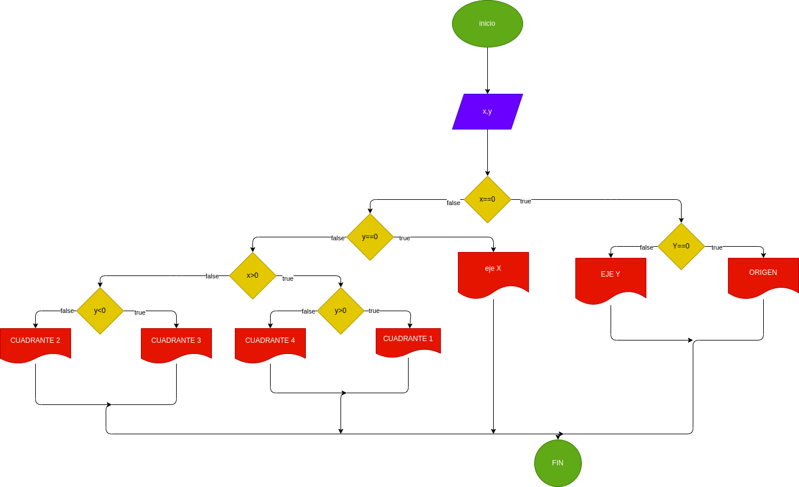

# EJERCICIO NO.1

## programa que lea las coordenadas cartesianas (x, y) de un punto en el plano y calcule el cuadrante al cual pertenece el punto.

# ANALISIS

variables de entrada (input)

x,y: coordenadas del punto
variables de salida

eje x
eje y
origen
cuadrante 1
cuadrante 2
cuadrante 3
cuadrante 4

nos indicara el punto exacto en el plano cartesiano

# DISEÑO

