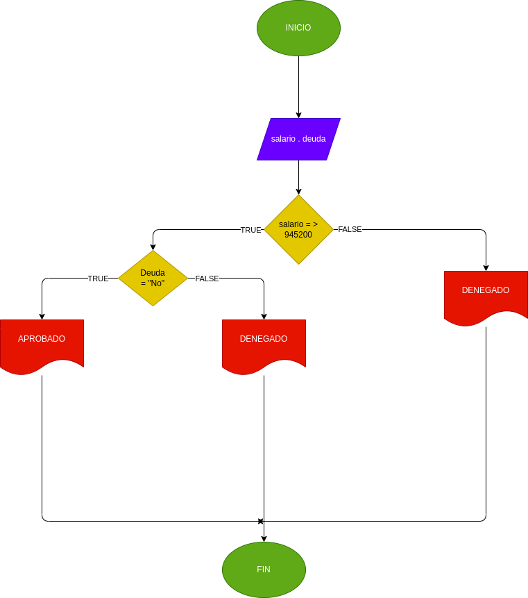

## prestamo bancario
progama para si usted puede adquirir un prestamo en banco segun su salario y si tiene de deudas anteriores 
# ANALISIS

variables de entrada

salario = el dinero nesesario para adquirir el prestamo
Deuda = saber si tiene deudas anteriores

variables de proceso
salario >= numero de ingreso 
Deuda = si o no tienes deudas 

variable de salida 

Aceptado = su prestamo fue aceptado 
Denegado = su prestamo fue denegado 

Nos indicara si se acepto o se denego su prestamo

# DISEÑO

# CONSTRUCCION 
