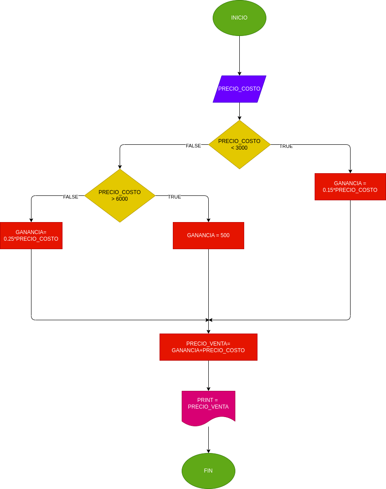

## PRECIO EN UNA PAPELERIA 
programa pra saber el precio adecuado de venta en una papeleria de diferentes productos segun su precio 
# ANALISIS

--variable de entrada 

PRECIO_COSTO = la variable del precio al que compramos el producto 

--variables de proceso 

GANANCIA = es el precio de costo por el porcentaje necesario de acuerdo al precio
PRECIO_VENTA = (GANANCIA + PRECIO_COSTO)

--variables de salida 

PRECIO_VENTA = es el precio obtimo para vender el producto

--
# DISEÑO

# CONSTRUCCION 
