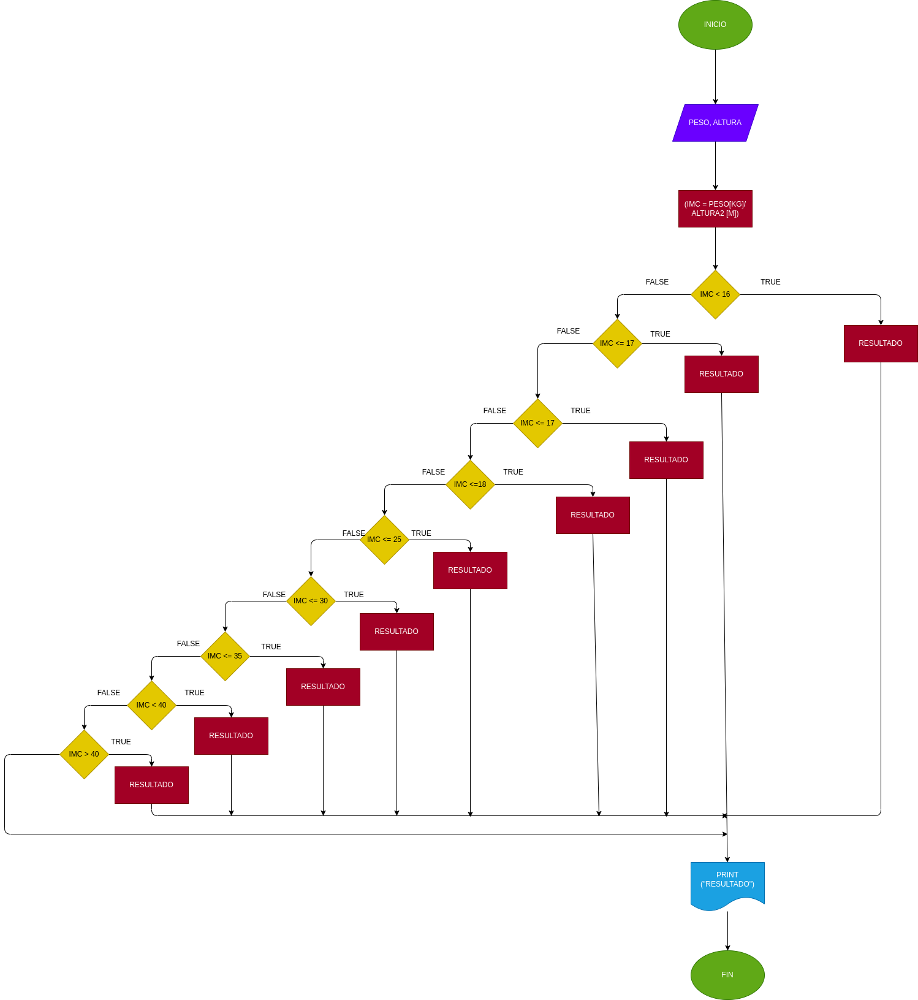

# MASA CABO
Programa para saber su masa corporal deacuerdo a su peso y altura

## ANALISIS
--Variables de entrada

PESO = su peso ingresado ALTURA = su altura ingresada

--variables de proceso

RESULTADOS = son los resultados de su índice de peso

--Variables de salida

IMC Y RESULTADOS = sultan si indice de peso y el resultado de estos

--

# DISEÑO
